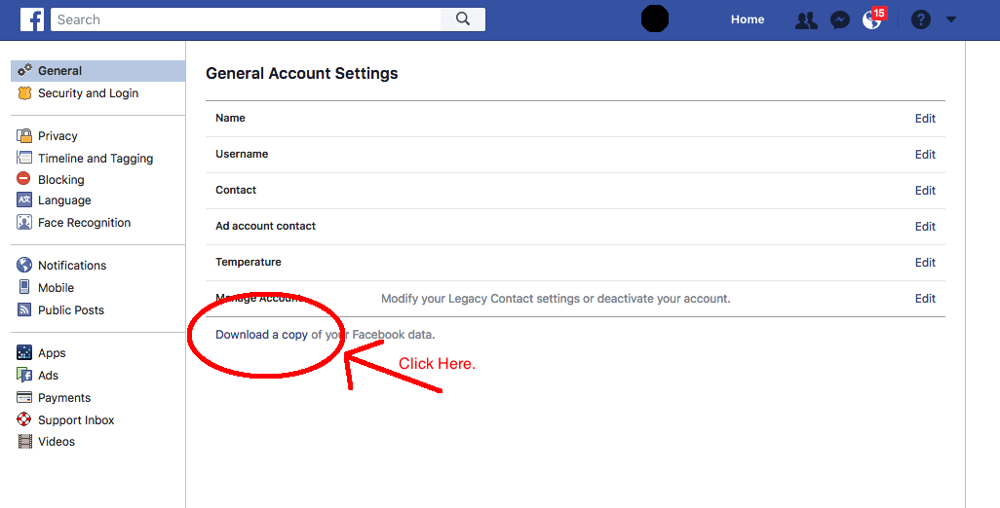

# parse_facebook

In the news right now is a lot of head scratching about facebook data. I became curious about what do they know and is it stuff I generally want people to know, or do I need to be more careful about my online presence (and can I even control this stuff?).  I also want to empower other people to be able to explore their data and gain insights about themselves.

I am sure this isn't even an original idea and someone else has done it and done it better than me. Oh well, please send me the link to the superior project and I will chalk this project up to experience.

## Setup and Requirements

Currently running Python 3.4.  Not compatible with Python 2.7. 

* xml.etree.ElementTree, re, string, os, datetime
	* Default modules in python
* pandas
	* [Installation Instructions here](https://pandas.pydata.org/pandas-docs/stable/install.html)
* folium
	* [Installation Instructions here](http://folium.readthedocs.io/en/latest/installing.html#installation)

## Get Your Facebook Data
Sure, there is the api, and that is great if you are building a facebook app or a bot or something.  But if you are just stand alone asking "What about me?" the link to get your facebook data is here.

1. Go [here](https://www.facebook.com/settings). 
2. Click the `Download a copy of your data.` link in really tiny print at the bottom of the settings. The file should download as a .zip file with the format "facebook - {Name}".

2. Unzip the file into a folder.
2. Download or Clone the repo.  Cloning the repo is a bit much right now.
3. Navigate into the location "facebook - {Name}/html"
4. Run the command `python parse_facebook.py`

The output should be a bunch of csv files with the same names as the htm files in the html folder.  

## Next Steps
I want to put out some plots that will show what I have done on facebook. Maybe even some NLTK on my messages or something fancy.

### Research Questions
* Have I ever quit facebook?
* Has my activity changed over time?
* [suggest more questions](https://github.com/polkapolka/parse_facebook/wiki/Research-Questions)

